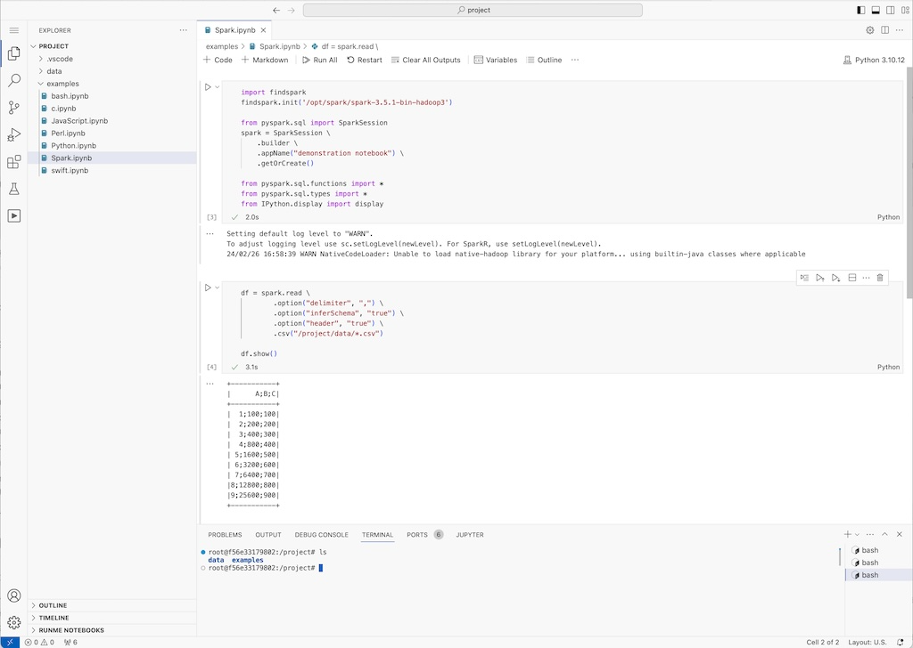

# CodeBook 

A code-server that runs several projects in different languages. In addition, all supported 
languages can be used in a Jupyter Notebook. 

The goal for this Project is to provide an environment for teaching and learning and 
provide a unified environment for data scientists and code enthusiasts. 

## Supported languages
- c
- perl
- bash
- node / typescript
- python
- swift 
  

## Installed Kernels: 
- c          /root/.local/share/jupyter/kernels/c
- iperl      /root/.local/share/jupyter/kernels/iperl
- bash       /usr/local/share/jupyter/kernels/bash
- jslab      /usr/local/share/jupyter/kernels/jslab
- python3    /usr/local/share/jupyter/kernels/python3
- tslab      /usr/local/share/jupyter/kernels/tslab
  
## Installed and ready to go libraries 
- Apache Spark

  
## Still missing language support 
- Rust
- Go

# How to run codebook

## From Source
1. download the sources from github
2. build the container with `./build.sh`
3. run it `run.sh`

Wait until your browser opens



## Quick code from withhin the current directory 
```
curl https://raw.githubusercontent.com/KrisSimon/CodeBook/main/codebook.sh | sh -
```

This will download the docker-compose file and start CodeBook from the current directory 